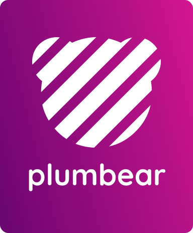
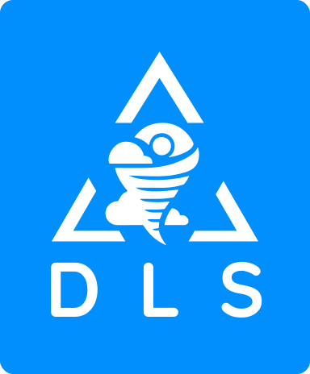

# Hey, I'm JkFussy 👋

I create tools, apps, and libraries — and I'm building the **PlumBear Ecosystem** 🪶  
Currently working on **PlumOS**, a **new universal operating system written in Rust**, featuring a **hybrid kernel**, **POSIX/BSD compatibility**, and **cross-system support**.

PlumOS can run and interface with **Win32**, **Linux**, **BSD**, **macOS**, and **Android** subsystems through internal translators.  
It includes a **modular bootloader** capable of launching kernels in multiple formats: `.elf`, `.pe`, `.coff`, `.mach-o`, and `.plam`.

Aiming for a **standardized, elegant, and developer-friendly system** — not another Linux clone, but a reimagined OS designed from scratch.

---

## 🌐 Languages / Языки

- [English](README.md) | [Русская версия](README.ru.md)

---

## 🖼️ PlumBear & DLS

  
  

> *Building the future of computing and art — one pixel and one line of Rust at a time.*

---

## 🌍 Socials

- 📱 Telegram: [@JkFussy](https://t.me/JkFussy)  
- 💬 Discord: `@JkFussy`  
- 🔗 Linktree: [linktr.ee/JkRen](https://linktr.ee/JkRen) — *2D artist, designer, programmer*

---

## 🧠 Tech Stack

  

**Programming languages:** Rust, C, C++, Assembly  
**Spoken languages:** English, Russian

---

## 🧩 Current Work

- 🪶 **PlumOS** — Universal OS with hybrid kernel, POSIX/BSD base, multi-subsystem compatibility (Win32, Linux, BSD, macOS, Android)  
- 🧰 **Modular Bootloader** — Supports `.elf`, `.pe`, `.coff`, `.mach-o`, `.plam`

---

## 🚀 Future Roadmap

| Feature                 | Description                                  |
|-------------------------|----------------------------------------------|
| 🌈 Pireon Render API    | Next-gen rendering layer                     |
| 🧭 PlumUI APU Framework | Advanced UI & application system             |
| 🧱 PlumEngine           | Engine for games, apps, websites             |
| 🛍 PlumStore            | Ecosystem marketplace                        |
| 💬 Otrix Language       | Modern language blending low/mid/high levels |
| ⚙️ Prum64 Architecture | Native architecture for PlumOS & Otrix       |

---

## 🏜 Projects

- 🧩 Developer of **[PlumOS](https://github.com/JkFussy/PlumOS)** *(coming soon)*  
- 🎨 Founder of **[Desert Lands Studio](https://linktr.ee/JkRen)** — 2D art, design, indie games like *Jumpfos*  
- 🧠 Designer of **Otrix** language & **Prum64** architecture

---

## 📌 Quick Links

- [Telegram Profile](https://t.me/JkFussy) — Contact me directly  
- [Linktree](https://linktr.ee/JkRen) — Portfolio, art, Patreon, games

---

> 📣 *Follow my journey building PlumOS — a new OS from scratch, built for developers and creators.*
